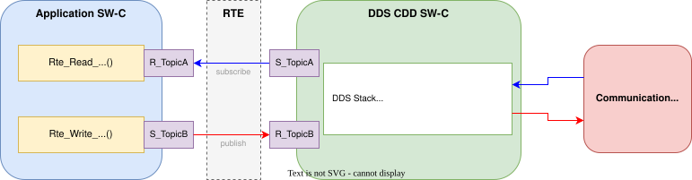

# Connext Micro 4 - MICROSAR Integration Guide

This is a brief checklist for integrating **Connext Micro 4.3.0** into a Vector MICROSAR 4 (Classic) ECU project.

> **Note:** Each step references sections in the online Micro documentation.
> All section links point to the LTS release at
> [community.rti.com](https://community.rti.com/static/documentation/connext-micro/current/doc/html/index.html).
> Section numbers may differ slightly from the local ER1 installation docs, as some sections were added in the LTS release.

## Reader Roadmap

This guide follows the actual integration workflow used in production projects. You will start by verifying that the platform libraries compile and link cleanly on your target, then prepare the DDS model and deployment data, run code generation, integrate with AUTOSAR BSW components, and finally validate end-to-end communication. Each step builds on the previous one, so if you encounter build or link errors, return to the relevant step to resolve it before proceeding.

**Integration steps in order:**

0. **Setup and Prerequisites:** Confirm you have all tools, target hardware, networking, and TcpIp prerequisites in place.
1. **Validate PIL/PSL Integration Baseline:** Prove that Connext Micro libraries compile and link cleanly on your target *before* adding any DDS application logic.
2. **Get the System XML:** Obtain the DDS system definition (participants, topics, endpoints, QoS) from the system integrator.
3. **Complete Deployment XML:** Add ECU-specific runtime configuration: heap areas, resource IDs, and network settings.
4. **Generate Code with MAG:** Run code generation tools to produce initialization code, AUTOSAR ARXML, and adapter layer source.
5. **Configure BSW and CDD:** Integrate the DDS Complex Device Driver into AUTOSAR, configure Socket Owner/TcpIp bindings, and align task scheduling.
6. **Verify Communication:** Validate publish/subscribe behavior end-to-end using Admin Console or a dummy PC application.

## 0. Prerequisites

Before starting, you must have the following hardware and software:
- A target ECU with Ethernet MAC (Media Access Control) and PHY (Physical Layer Transceiver)
- Ethernet cable and network switch
- Windows or Linux PC with RTI Admin Console installed (included with Connext Drive) to validate communication
- AUTOSAR BSW with operational TcpIp stack
- UDP must be validated as working
- Run Time Environment (RTE) generator and configuration tools
- Build toolchain for target platform
- Connext Drive and Connext Micro 4.3.0 installed. See section [*1.1.3. Installing Connext Micro*](https://community.rti.com/static/documentation/connext-micro/current/doc/html/gettingstarted/before.html#installing-me-h) in the Micro documentation.
- Set the environment variables specified in section [*1.1.3.3. Paths mentioned in documentation*](https://community.rti.com/static/documentation/connext-micro/current/doc/html/gettingstarted/before.html#paths-mentioned-in-documentation) in your working environment.


## 1. Validate PIL/PSL Integration Baseline (Library Integration Without DDS Application)

This version of Connext Micro uses a PIL/PSL model, where the core functionality is shipped as a precompiled library (PIL) and the platform-dependent part is provided as source for more flexible integration. This is explained in section [*6.1. Platforms Introduction*](https://community.rti.com/static/documentation/connext-micro/current/doc/html/platformnotes/introduction.html) in the Micro documentation. The purpose of this step is to verify that you link and compile the libraries correctly before proceeding.

- **PIL** (Platform Independent Library): architecture/compiler-specific RTI libraries that are not tied to a specific AUTOSAR vendor integration.
- **PSL** (Platform Support Library): platform/vendor adaptation layer (OS, network, synchronization, heap) for a specific AUTOSAR stack and integration model.

**Platform Naming convention in `lib/`:**
- `<arch-compiler>` for PIL
- `<arch-compiler>-<platform>` for PSL.

Example: `tc39xtTasking6.3r1` (PIL) and `tc39xtTasking6.3r1-MICROSAR4` (PSL).

> **Note:** On some installations the directory names include an additional `Elf` segment
> (e.g. `tc39xtElfTasking6.3r1`). If the path without `Elf` does not exist, look for the
> `Elf` variant. The architecture identifier used by the build system and documentation
> tables remains `tc39xtTasking6.3r1`.

> **Note:** This guide only considers PSL source integration. Precompiled PSL libraries under `RTIMEHOME/lib/<arch-compiler>-<platform>/` are not used in this workflow.

### Step 1a: Verify Compiler & ABI Compatibility

1. **Confirm target architecture and compiler for pre-compiled PIL libraries**:
  - Select the architecture/compiler pair used by your ECU toolchain.
  - PIL library path pattern: `RTIMEHOME/lib/<arch-compiler>/`
  - Example: TriCore TC39X with TASKING v6.3r1 uses `RTIMEHOME/lib/tc39xtTasking6.3r1/`

2. **Apply compiler flags** (from your selected platform notes; see section [*6.7.4. How the PIL was built for MicroSAR platforms*](https://community.rti.com/static/documentation/connext-micro/current/doc/html/platformnotes/microsar.html#how-the-pil-was-built-for-microsar-platforms) for the MICROSAR example):
   - All source files (generated code, AUTOSAR code, and PSL source) must be compiled with the selected PIL-compatible flags.
   - **Example PIL flags for TriCore TC39X + TASKING v6.3r1 (Release)**:
     ```
     -Ctc39xb -D__CPU__=tc39xb -D__CPU_TC39XB__ --core=tc1.6.2 --align=0
     -O2ROP -DNDEBUG
     ```
   - **Example PSL-specific flags** (in addition to PIL flags):
     ```
     -D__autosar__=1 -DRTI_ENDIAN_LITTLE=1 -DRTIME_AUTOSAR_MICROSAR=1 -DRTI_AUTOSAR=1
     ```

   > **Important:** The above are minimal examples. The complete set of flags that RTI used
   > to build the PIL and PSL (including floating-point model, language mode, and warning
   > suppression) is listed in sections [*6.7.4. How the PIL was built*](https://community.rti.com/static/documentation/connext-micro/current/doc/html/platformnotes/microsar.html#how-the-pil-was-built-for-microsar-platforms) and [*6.7.5. Building the PSL from source*](https://community.rti.com/static/documentation/connext-micro/current/doc/html/platformnotes/microsar.html#building-the-psl-from-source-for-microsar-platforms).
   > Your build **must** use compatible flags to avoid ABI mismatches with the precompiled PIL.

### Step 1b: Integrate PIL Required Libraries

Section [*2.1.3. Link applications and libraries*](https://community.rti.com/static/documentation/connext-micro/current/doc/html/developing/prepare_development_environment.html#link-applications-and-libraries) in the Micro documentation describes the libraries available in Connext Micro.

Due to Connext Micro modularity, the user can choose the libraries to link in the project based on the features used.

For this initial validation, using UDP transport and DPDE or DPSE discovery plugin, include these libraries:

- `rti_me_appgen`
- `rti_me_discdpde` (If using DPDE) or `rti_me_discdpse` (If using DPSE)
- `rti_me`
- `rti_me_rhsm`
- `rti_me_whsm`

> **Note:** If you are unsure about using DPDE or DPSE, you can check what is defined in DDS-XML, under `builtin_discovery_plugins` tag. `SDP` indicates DPDE and `DPSE` is DPSE.

### Step 1c: Integrate PSL Source Files

The PSL provides AUTOSAR-specific implementations.

PSL precompiled libraries are shipped with Connext Micro, but this guide uses PSL source code integration because each platform and version may require specific adaptations. Add PSL source files to your build from `RTIMEHOME/src/rti_me_psl/`.

The MICROSAR PSL is highly portable and we do not expect significant issues. However, RTI does not officially support or validate the PSL on every vendor platform. RTI can assist with troubleshooting, but the ultimate responsibility for ensuring the PSL works correctly on the specific platform lies with the supplier.

We recommend trying the PSL source files as-is first. Only modify them if you encounter build errors or runtime issues specific to your platform.

#### AUTOSAR OS Abstraction Layer Sources

Located in `src/rti_me_psl/ospsl/autosar/`:

| File | Purpose |
|------|--------|
| `autosarSystem.c` | System initialization, global state management |
| `autosarProcess.c` | Process abstraction (startup/shutdown hooks) |
| `autosarMutex.c/h` | AUTOSAR resource-based mutual exclusion |
| `autosarSemaphore.c/h` | Semaphore emulation via AUTOSAR Events and Alarms |
| `autosarHeap.c/h` | Static heap allocator (no free operation; must pre-size) |
| `autosarThread.c` | AUTOSAR task lifecycle and runnable invocation |
| `autosarLog.c` | Logging to buffer or remote sink |
| `autosarString.c` | String utilities for AUTOSAR environment |

#### AUTOSAR Network I/O (UDP/TcpIp) Sources

Located in `src/rti_me_psl/netiopsl/udp/autosar/`:

| File | Purpose |
|------|--------|
| `autosarSocket.c/h` | UDP Socket Owner mechanism and TcpIp binding |

### Step 1d: Build and Verify (No Application Code Yet)

1. **Compile and link:**
   - Apply compiler flags from Step 1a
   - Link with the library set from Step 1b
   - Verify: No unresolved symbols, no linker warnings about conflicting libraries

2. **Check ABI compatibility:**
   - Verify all object files compile without errors and link successfully

### Acceptance Criteria

This step passes when:

✅ All PIL and PSL libraries are present in the expected paths  
✅ No ABI mismatches or compiler version conflicts are reported  
✅ All 9 OS PSL + 2 network PSL source files compile cleanly alongside PIL  

## 2. Get the System XML from the system integrator

The DDS system XML file defines all DDS entities (participants, publishers, subscribers, data writers, data
readers), QoS settings and types for your application. This should be the source of truth for both MAG code generation and for configuring the MICROSAR side.

Obtain this file from the system integrator. The XML must include all type definitions and participant/endpoint configurations needed before the following steps can proceed. See section [*3.17.5.1. Define your system in DDS system XML*](https://community.rti.com/static/documentation/connext-micro/current/doc/html/programmersguide/appgen.html#define-your-system-in-dds-system-xml) in the Micro documentation.

The XML may not contain all necessary configurations (platform-specific details, IP configuration, etc.). **These must be added before generating the code**. See the next section.

> **Note:** Connext Micro does not load DDS-XML at runtime - MAG must regenerate C initialization code
> whenever the system XML changes.


## 3. Complete the XML with deployment information and any other missing configurations

The system XML from step 2 usually does not contain project-specific deployment values. Before code generation, you must populate deployment-specific elements that configure the DDS system for the target ECU environment.

### Example: Deployment Configuration

Below is an example of deployment XML. A `deployment_scenario` groups all the deployments that need to communicate. For **DPSE** (Static Endpoint Discovery), all communicating participants **must** appear in deployments within the **same** `deployment_scenario` — this is how MAG knows which remote entity assertions to generate for each deployment.

```xml
<!-- Applications: one per executable / ECU -->
<application_library name="MyApplicationLib">
    <application name="MyApplication" isCert="false">
        <domain_participant name="MCU_DDS_CDD"
            base_name="ParticipantLibrary::MCU_DDS_CDD" />
    </application>
    <!-- PC peer used for testing DPSE communication -->
    <application name="NativeTestApp" isCert="false">
        <domain_participant name="PC_Peer_DP"
            base_name="ParticipantLibrary::PC_Peer_DP" />
    </application>
</application_library>

<node_library name="MyNodeLib">
    <node name="MyNode1" />  <!-- ECU -->
    <node name="MyNode2" />  <!-- PC -->
</node_library>

<deployment_library name="MyDeploymentLib">
  <deployment_scenario name="MyDeploymentScenario">
    <!-- ECU deployment (AUTOSAR CDD) -->
    <deployment name="ECU1_Deployment">
      <node node_ref="MyNodeLib::MyNode1" />
      <applications>
        <application name="MyApp" application_ref="MyApplicationLib::MyApplication" />
      </applications>
      <configuration>
        <autosar>
          <!-- Heap configuration for static memory allocation -->
          <heap>
            <element>
              <size>250</size> <!-- Size in KB-->
              <start_address>0x60000100</start_address>
              <name>Heap_area_1</name>
            </element>
          </heap>
          <!-- Synchronization configuration: AUTOSAR resource ID for mutex -->
          <mutex_resource_id>OsResource_000</mutex_resource_id>
          <!-- Local address allocation for discovery -->
          <max_local_addr_id>4</max_local_addr_id>
          <send_local_addr_id>0</send_local_addr_id>
        </autosar>
      </configuration>
    </deployment>
    <!-- PC peer deployment (native application, no AUTOSAR config) -->
    <deployment name="PcPeerDeployment">
      <node node_ref="MyNodeLib::MyNode2" />
      <applications>
        <application name="NativeTestApp" application_ref="MyApplicationLib::NativeTestApp" />
      </applications>
      <!-- No <configuration> needed for native (non-AUTOSAR) applications -->
    </deployment>
  </deployment_scenario>
</deployment_library>
```

> **Important (DPSE users):** MAG only generates DPSE remote entity assertions for participants
> that are part of a deployment in the same `deployment_scenario`. If you only define the ECU
> deployment and omit the PC peer deployment, the generated code will have
> `remote_participant_count = 0` and DPSE matching will fail. Always include **all**
> communicating participants in their own deployments within the same scenario.

The ECU deployment's `<configuration><autosar>` section must define:
- **Heap areas**: Multiple static memory regions for DDS objects (sizes in KB, with absolute start addresses). More than one region can be defined. We recommend a minimum of 250KB.
- **mutex_resource_id**: AUTOSAR resource for synchronization. Must match resource name in AUTOSAR config.
- **max_local_addr_id**: This is the maximum ID in your TcpIp address configuration.
- **send_local_addr_id**: This is the ID of the TcpIp address used to send data.

For complete reference of all the AUTOSAR PSL port configuration, see section [*6.7.2.4. OSAPI_PortProperty reference*](https://community.rti.com/static/documentation/connext-micro/current/doc/html/platformnotes/microsar.html#section-osapi-portproperty-reference) in the Micro documentation.

> **Note:** MAG does not support setting all OSAPI_PortProperty fields via XML. Refer to the MAG schema (XSD) for the list of supported XML properties. Any remaining properties must be set directly in the generated adapter source code (`dds_cdd_adapter.c`). The guidance below on what values to use applies regardless of whether you configure them in XML or source code.

Any other relevant configurations (e.g. IP addresses) that are distributed outside the DDS-XML file MUST be incorporated into the DDS-XML before generating any code. See section [*3.17.5.1. Define your system in DDS system XML*](https://community.rti.com/static/documentation/connext-micro/current/doc/html/programmersguide/appgen.html#define-your-system-in-dds-system-xml) for an example of a complete DDS-XML definition.

## 4. Generate code with MAG and ARCGEN

MAG (`rtiddsmag`) reads the system XML and generates all C source and header files needed to
initialize DDS entities at startup, plus the AUTOSAR integration layer.

Steps:
1. Run MAG with the `-deployment` and `-applicationType AUTOSAR_CDD` selectors as described in section [*3.17.5.2. Run MAG with deployment and application type selectors*](https://community.rti.com/static/documentation/connext-micro/current/doc/html/programmersguide/appgen.html#run-mag-with-deployment-and-application-type-selectors).
  ```cmd
  %RTIMEHOME%\bin\rtiddsmag.bat -inputXml <system_xml_path> -deployment MyDeployment1 -applicationType AUTOSAR_CDD -language C -replace
  ```
2. Run `rtiarcgen -ddsTypeSupport` to generate the AUTOSAR type ARXML and DDS type-support C code in one
  pass (do **not** call `rtiddsgen` separately—it can produce conflicting type definitions).
   See section [*3.17.5.3. Generate AUTOSAR type ARXML with rtiarcgen*](https://community.rti.com/static/documentation/connext-micro/current/doc/html/programmersguide/appgen.html#generate-autosar-type-arxml-with-rtiarcgen).
  ```cmd
  mkdir <MAG_output_folder>/<Domain_Participant_name>/dds_gen
  cd <MAG_output_folder>/<Domain_Participant_name>/dds_gen
  set RTIDDSGEN_PATH=%RTIMEHOME%\rtiddsgen\scripts\rtiddsgen.bat
  set RTIDDSGEN_PARAMS=-create typefiles -micro -language C -ppDisable

  %RTIMEHOME%\..\bin\rtiarcgen -arxmlTypes <system_xml_path> -arxmlPath . -singleFile -target AUTOSAR -ddsTypeSupport -conversions
  ```

3. **Import all three ARXML outputs into your AUTOSAR toolchain** (DaVinci, etc.) **in this order**:
  1. `<MAG_output_folder>/<participant_name>/dds_gen/<types>.arxml` - DDS type definitions generated by `rtiarcgen` (**import first** so type references resolve)
  2. `<MAG_output_folder>/<cdd_component>/autosar_model/<cdd_type>.arxml` - CDD SW-C description generated by MAG
  3. `<MAG_output_folder>/<application_component>/autosar_model/application.arxml` - Example application composition generated by MAG. **It is not mandatory to use this to interface with DDS**, this is just an example to verify communication.

   See section [*3.17.5.4. Import both ARXML outputs into AUTOSAR toolchain*](https://community.rti.com/static/documentation/connext-micro/current/doc/html/programmersguide/appgen.html#import-both-arxml-outputs-into-autosar-toolchain).

  After importing, make sure the RTE ports on the `DdsCdd` component are connected to the application SW-C ports for each topic.

> **Note:** The default values for the data types defined in ARXML may not match the actual data type structures. If this happens, simply fix the default values so they match the types in your AUTOSAR toolchain.

4. Add all generated `.c`/`.h` files to the ECU build system alongside the Connext Micro and PSL libraries.

**After generation, review the generated code:**

- MAG generates a layered code structure: a DDS implementation layer (`dds_impl/`), an AUTOSAR runnable
  layer (`autosar_gen/`), and an **adapter layer** (`adaptation/`) that connects AUTOSAR runnables to DDS
  read/write calls.
- The adapter layer files contain `TODO` markers for mandatory application-specific logic (e.g., copying data
  between AUTOSAR signals and DDS samples, error handling, lifecycle hooks). These must be completed before
  the ECU will function.
- See section [*3.17.5.5.4. Adapter layer*](https://community.rti.com/static/documentation/connext-micro/current/doc/html/programmersguide/appgen.html#adapter-layer) for examples of generated code and adapter patterns.

For limitations and troubleshooting, see
section [*3.17.5.7. Limitations and considerations*](https://community.rti.com/static/documentation/connext-micro/current/doc/html/programmersguide/appgen.html#limitations-and-considerations)
and section [*3.17.6.7. Troubleshooting*](https://community.rti.com/static/documentation/connext-micro/current/doc/html/programmersguide/appgen.html#troubleshooting).

## 5. Configure BSW

Connext Micro integrates into AUTOSAR Classic as a **Complex Device Driver (CDD)**. The BSW must provide
a working **Ethernet/TCP-IP stack** that the Connext Micro PSL (Platform Support Layer) can use for
UDP transport.

Your BSW configuration must match what is described in section [*6.7.2. How to configure MicroSAR*](https://community.rti.com/static/documentation/connext-micro/current/doc/html/platformnotes/microsar.html#how-to-configure-microsar),
specifically [*6.7.2.1. DDS CDD configuration*](https://community.rti.com/static/documentation/connext-micro/current/doc/html/platformnotes/microsar.html#section-dds-cdd-configuration)
and [*6.7.2.2. BSW configuration*](https://community.rti.com/static/documentation/connext-micro/current/doc/html/platformnotes/microsar.html#bsw-configuration).

### 5.1 CDD Runnables

The DDS CDD component (`DdsCddType`) requires the following runnables:

| Runnable | Trigger | Purpose |
|----------|---------|--------|
| `Start` | INIT-EVENT (once at boot) | Initializes the DDS CDD |
| `Run` | TIMING-EVENT (periodic) | Maintains DDS protocols (discovery, liveliness, reliability) |
| `RxIndication` | Called by TcpIp stack | Buffers received UDP data (only if `use_udp_thread = TRUE`) |
| `ProcessData` | INTERNAL-TRIGGER-OCCURRED-EVENT | Dispatches buffered UDP packets to DataReaders (only if `use_udp_thread = TRUE`) |

> **Note:** When `use_udp_thread` is FALSE, incoming UDP packets are processed directly in the
> TcpIp callback context and the `RxIndication`/`ProcessData` runnables are not needed.

### 5.2 OS Configuration

The DDS CDD requires the following OS resources:

- **OS Resource**: One STANDARD resource for internal synchronization (matches `mutex_resource_id` from deployment XML).
- **Events**: If semaphores are used (`semaphore_max_count > 0`), configure AUTOSAR events (each ID must be a power of 2).
- **Alarms**: Required for semaphore timeout support if semaphores are used.
- **Task**: At least one dedicated OS task (e.g., `Task_DdsCdd`) with the following **minimum stack sizes**:
  - Task running `DdsCddRun`: **2 KB**
  - Task running topic read/write runnables: **8 KB**
  - Task running `RxIndication`/`ProcessData` (if `use_udp_thread = TRUE`): **5 KB**
  - Total additional stack across all DDS tasks: **15 KB minimum**

Task priority: higher than application SW-Cs, lower than critical BSW (Ethernet driver, TcpIp stack).

### 5.3 TcpIp Configuration

- **Socket Owner**: Register the DDS CDD as socket owner with callbacks:
  - `RxIndication`: `NETIO_Autosar_TcpIp_udp_rx_indication`
  - `LocalIpAddrAssignmentChg`: signals IP readiness to the CDD
- **UDP Sockets**: Minimum 2 (unicast), 3 if multicast is enabled.
- **IP Address**: A static or DHCP-assigned address must be available before DDS initializes.

### 5.4 BswM Boot Sequencing

DDS entities must only be created **after** the TcpIp stack is up and an IP address is assigned,
because entity creation triggers discovery messages on the network.

Recommended sequence:
1. TcpIp stack initializes and assigns an IP address.
2. The `LocalIpAddrAssignmentChg` callback for the socket owner fires.
3. Only after this callback should the DDS CDD proceed with creating DDS entities.

> **Important:** If DDS entities are created before TcpIp is ready, discovery packets will be
> lost and the participant will fail to communicate with peers. 

## 6. Verify communication

### How the Application SW-C communicates with the DDS CDD

The DDS CDD exposes one **RTE Sender/Receiver port per DDS topic**. Your Application SW-C connects
to these ports through the RTE, using standard `Rte_Read_...()` / `Rte_Write_...()` calls. The
DDS CDD handles all DDS protocol operations internally (discovery, serialization, transport).



**Port naming convention** (one pair per topic):

| Direction (from App perspective) | App Port | CDD Port | Data Flow |
|----------------------------------|----------|----------|-----------|
| App **subscribes** (reads from network) | `R_<TopicName>` (Receiver) | `S_<TopicName>` (Sender) | Network → DDS Stack → CDD S port → RTE → App R port |
| App **publishes** (writes to network) | `S_<TopicName>` (Sender) | `R_<TopicName>` (Receiver) | App S port → RTE → CDD R port → DDS Stack → Network |

- **R** (Receiver) port = consumes data from the RTE
- **S** (Sender) port = provides data to the RTE
- MAG generates port definitions for both the CDD and the example ASWC. Your production ASWC must
  declare matching R/S ports for each topic it uses.

### Testing with the example ASWC

In order to quickly test the communication, MAG generates an example ASWC ARXML. **It is not mandatory to use this ASWC**, any ASWC can interface with Connext Micro by using the correct RTE ports. However, the example ASWC is the most direct way to verify the communication.

To test that DDS is working, generate the template for the example ASWC using your vendor's tools, and fill the periodic runnable with logic that writes to and reads from topics through the RTE. For example:

```
FUNC(void, AutosarApp_CODE) AutosarAppPeriodic(void) /* PRQA S 0624, 3206 */ /* MD_Rte_0624, MD_Rte_3206 */
{
/**********************************************************************************************************************
 * DO NOT CHANGE THIS COMMENT!           << Start of runnable implementation >>             DO NOT CHANGE THIS COMMENT!
 * Symbol: AutosarAppPeriodic
 *********************************************************************************************************************/
  Std_ReturnType result;
  SeatCommand_t seatCommand;
  SeatStatus_t seatStatus;
  static uint8_t counter = 0;

  /* Read input from Rte */
  result = Rte_Read_R_ZcRR_SeatCmd_SeatCommand_t(&seatCommand);
  if (result == RTE_E_OK)
  {
    /* Process the read data */ 
  }

  /* Write output to Rte */
  /* Update seatStatus with the new values */
  seatStatus.fore_aft_pct = counter; /* Example value, replace with actual processing */
  seatStatus.recline_pct = counter; /* Example value, replace with actual processing */
  counter = (counter + 10) % 256; /* Increment counter for demonstration purposes */
  result = Rte_Write_S_EcuSeat_Status_SeatStatus_t(&seatStatus);
  if (result != RTE_E_OK)
  {
    /* Handle write error */
  }

/**********************************************************************************************************************
 * DO NOT CHANGE THIS COMMENT!           << End of runnable implementation >>               DO NOT CHANGE THIS COMMENT!
 *********************************************************************************************************************/
}
```

Adapt the types and topic names to match yours.

### Setting up another peer

In order to actually test the communication, a Domain Participant must be running on a different peer (i.e. a PC). Depending on the discovery module being used, a different approach must be taken:

- If using DPDE, follow the instructions in the [Admin Console Guide](adminconsole/Admin%20console%20guide.md) to verify communication using Admin Console.
- If using DPSE, follow the instructions below.

### Testing with DPSE: Generating a native PC application

When using DPSE (Static Endpoint Discovery), Admin Console cannot be used because it relies on dynamic discovery. Instead, you must generate a native Connext Micro application for Windows that acts as the communication peer.

This workflow uses MAG's **native deployment-aware code generation** (section [*3.17.6. Generating native DDS applications with deployment-aware code generation*](https://community.rti.com/static/documentation/connext-micro/current/doc/html/programmersguide/appgen.html#generating-native-dds-applications-with-deployment-aware-code-generation)) to produce a standalone Windows executable from the **same DDS System XML** used for the AUTOSAR ECU.

#### Prerequisites

- Connext Micro 4.3.0 installed on the PC
- CMake 3.14+ installed
- C compiler (e.g., Visual Studio 2017+)
- The `RTIMEHOME` environment variable set to the Connext Micro installation path
- The `RTIME_TARGET_NAME` environment variable set to the Windows target (e.g., `x64Win64VS2017`)

#### Step 1: Verify the PC peer deployment exists in the DDS System XML

If you followed Section 3, your XML already contains a `PcPeerDeployment` under the same `deployment_scenario` as the ECU deployment. Verify that:

- The PC peer's Domain Participant is defined in the `domain_participant_library` with matching topics, QoS, and `rtps_object_id` values.
- An application referencing that participant exists in the `application_library`.
- A deployment for that application exists in the same `deployment_scenario` as the ECU deployment.

If the PC peer deployment is missing, add it now as shown in the Section 3 example. Without it, MAG will generate `remote_participant_count = 0` and DPSE matching will not work.

#### Step 2: Generate the native application with MAG

Run MAG targeting the PC peer deployment with `-applicationType micro4`:

```cmd
%RTIMEHOME%\bin\rtiddsmag.bat -language C -inputXml <system_xml_path> -d output -replace -deployment PcPeerDeployment -applicationType micro4 -verbosity 3
```

MAG generates the native application code under:
```
output\MyDeploymentLib\MyDeploymentScenario\PcPeerDeployment\NativeTestApp\
```

Because both deployments are in the same `deployment_scenario`, MAG automatically generates:
- The DPSE remote entity assertions for the ECU's endpoints.
- The correct `rtps_object_id` assignments for static endpoint matching.

#### Step 3: Generate type support files

Generate type support code using `rtiddsgen`. Since the types are defined in the DDS System XML, run from the `rtiddsmag` directory so the schema reference resolves:

```cmd
cd %RTIMEHOME%\rtiddsmag
%RTIMEHOME%\rtiddsgen\scripts\rtiddsgen.bat -create typefiles -micro -language C <system_xml_path> -d <path_to_output>\MyDeploymentLib\MyDeploymentScenario\PcPeerDeployment\NativeTestApp -replace
```

#### Step 4: Build with CMake

Set the required environment variables and build:

```cmd
set RTIMEHOME=C:\path\to\rti_connext_dds_micro-4.3.0
set RTIME_TARGET_NAME=x64Win64VS2017

cd output\MyDeploymentLib\MyDeploymentScenario\PcPeerDeployment\NativeTestApp
cmake -S . -B build_test
cmake --build build_test --config Release -j
```

After a successful build, the executable is located at:
```
objs\<RTIME_TARGET_NAME>\NativeTestApp.exe
```

#### Step 5: Run and verify communication

1. Ensure the PC and ECU are on the same network and can reach each other via UDP (verify with ping).
2. Start the ECU application (boot the ECU with the DDS CDD running).
3. Run the generated PC application:

```cmd
objs\x64Win64VS2017\NativeTestApp.exe
```

4. The application will:
   - Periodically publish samples on the topics the ECU subscribes to.
   - Print a message when it receives data from the ECU's published topics.

If communication is established, you will see output indicating samples are being sent and received.

#### Customizing the generated application

The generated `NativeTestApp.c` contains hook functions for each topic:

- **Write functions** (e.g., `<TopicName>_write`): Populate and publish data. Modify these to send meaningful test data.
- **Read callbacks** (e.g., `<TopicName>_read`): Called when data arrives. Modify these to print or process received fields.

See section [*3.17.6.6. Customizing native applications*](https://community.rti.com/static/documentation/connext-micro/current/doc/html/programmersguide/appgen.html#customizing-native-applications) for details.

> **Note:** For Linux, the workflow is identical except for path separators and the `RTIME_TARGET_NAME` value (e.g., `x64Linux4gcc7.3.0`). Use the shell equivalents (`export` instead of `set`, forward slashes, shell scripts without `.bat`). See section [*3.17.6.5. Building and running native applications*](https://community.rti.com/static/documentation/connext-micro/current/doc/html/programmersguide/appgen.html#building-and-running-native-applications) for Linux-specific commands.
